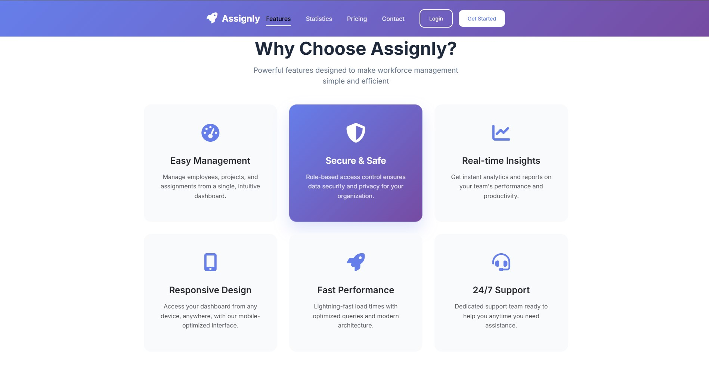
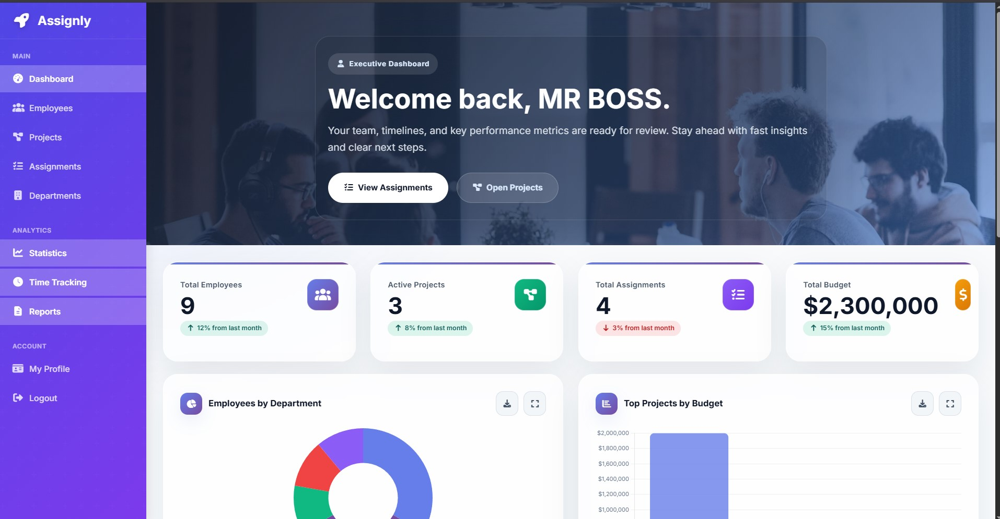
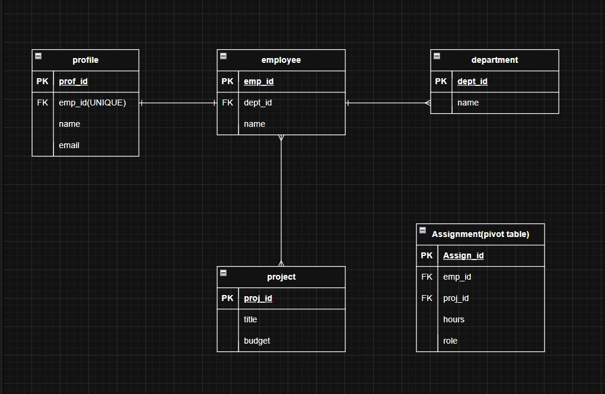

# Assignly


A Laravel-based staff management system built for a college WAD finals project. This application demonstrates secure CRUD workflows, role-based access control, and relational Eloquent models.

---

## 📘 Project Details

- **Project:** Assignly
- **Course:** Web Application Development (WAD)
- **Type:** project Finals
- **Author:** Gabaleo, Rimer-Rey A.
- **Partner:** Carbonel, Jess Marvin S.
- **Date:** May 3 2026

---

## 🚀 Overview

Staff Tracker allows authenticated users to manage the following entities:

- Departments
- Employees
- Projects
- Assignments

The application is built with:

- Laravel authentication and middleware
- Gate and policy authorization
- Eloquent model relationships
- Full CRUD functionality across all core entities

---

## ✨ Key Features

- Authentication and protected routes
- Role-based access control for admin and employee actions
- Authorization via gates and model policies
- Complete CRUD operations
- Eloquent relationships with `belongsTo`, `hasMany`, and `belongsToMany`
- Clean MVC structure with dedicated controllers, policies, and models

---

## 🖼 Visual Preview

| Landing Page | Dashboard |
| --- | --- |
|  |  |


---

## 🧠 Entity Relationship Diagram (ERD)




---

## 📌 What’s Included

- `routes/web.php` — authenticated routes and resources
- `app/Providers/AuthServiceProvider.php` — gate and policy registration
- `app/Policies/*Policy.php` — permissions by model
- `app/Http/Controllers/*Controller.php` — CRUD controllers with authorization checks
- `app/Models/*.php` — model definitions and relationships

---

## 🛠 Installation

1. Clone the repository.
2. Install dependencies:

```bash
composer install
npm install
```

3. Copy environment file:

```bash
cp .env.example .env
```

4. Generate application key:

```bash
php artisan key:generate
```

5. Run database migrations:

```bash
php artisan migrate
```

6. Start the application:

```bash
php artisan serve
npm run dev
```

---

## ▶️ Usage

- Visit the landing page as a guest.
- Register or log in to access the dashboard.
- Manage departments, employees, projects, and assignments.
- Verify role-based access control and ownership restrictions.

---

## 🧩 Authorization Flow

Authorization is implemented using:

- `Gate::define('admin-only', ...)` in `app/Providers/AuthServiceProvider.php`
- `authorizeResource()` in controllers
- policy methods in `app/Policies`

---

## 🔗 Model Relationships

The main Eloquent relationships are:

- `Employee` → `Department` (`belongsTo`)
- `Employee` → `Project` (`belongsToMany` via assignments)
- `Project` → `Employee` (`belongsToMany` via assignments)
- `Department` → `Employee` (`hasMany`)
- `Assignment` → `Employee` and `Project` (`belongsTo`)

---

## ROLES

- **Rimer-Rey A. Gabaleo** — Developer

- **Jess Marvin Carbonel** — SQA Reviewer

---

## 📄 License

MIT License
